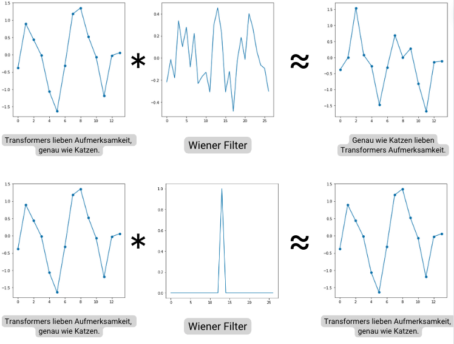

# Convolution Revolution: Wiener Filters for Embedded Text Comparison
## Integrating Signal Processing into Natural Language Processing

Author: Andrei Danila



## Overview

This repository contains the code for the experiments in the paper "Convolution Revolution: Wiener Filters for Embedded Text Comparison". The two main experiments are Wiener Loss (found in `wiener_transformer/`) and Wiener Attention (found in `wiener_attention/`). You can run the experiments as defined below in order to reproduce the results. To access detailed documentation of the code, please visit my [GitHub Pages](https://ese-msc-2023.github.io/irp-acd23//).

The Wiener Loss is a modification of the training loop of the transformer model. In addition to the KL divergence loss, it adds a Wiener loss term to the loss function. This loss term is calculated using the Wiener filter, which is a measure of the difference between the predicted and true outputs.

The Wiener Attention is a modification of the Transformer architecture that incorporates a Wiener filter into the self-attention mechanism. The Wiener filter is applied to the attention scores to reduce the impact of irrelevant features and enhance the representation of relevant features.

The Wiener Loss experiments were run on DGX 8x A100 GPUs. The Wiener Attention experiments were run on a single A10/A100 GPU.

Please see the report in the `/deliverables` folder for more details on the experiments and results.

## Setup

### Conda Environment

Create a new conda environment using the environment.yml file:
   ```
   conda env create -f environment.yml
   conda activate wiener_transformer
   ```

After setting up the conda environment, install the package in editable mode:

```
pip install -e .
```

### Accelerate Setup

Set up Accelerate for distributed training:

```
accelerate config
```

Follow the prompts to configure your environment. None of the experiments used non-default settings (such as mixed precision or DeepSpeed). Please see the `default_config.yaml` file for an example setup.

## Running Experiments

All experiments are run using a 'config.yaml' file. Below is an example of what the config file should look like for a Wiener Loss experiment:

```
batch_size: 32
distributed: True
num_epochs: 3
accum_iter: 2
base_lr: 1.0
max_padding: 200
warmup: 3000
file_prefix: "twostage_short_5050_learned_frozen"
N: 6
d_model: 512
wiener_loss: True
embedding_type: "learned_frozen"
base_dir: "."
automatic_weighted_loss: True
espilon: 1.0E-5
gamma: 0.1
```

and for a Wiener Attention experiment:

```
wiener_attention: True
eps: 1.0E-5
gamma: 0.1
epochs: 10
learning_rate: 0.001
batch_size: 32
max_len: 32
dir: "wiener1"
```

#### To run a Wiener Loss experiment:

accelerated
```
accelerate launch wiener_transformer/utils/train.py experiements/wiener_loss/<experiment_name>/config.yaml
```

non-accelerated
```
python wiener_transformer/utils/train.py experiements/wiener_loss/<experiment_name>/config.yaml
```

#### To run a Wiener Attention experiment:

```
python wiener_attention/train.py experiements/wiener_attention/<experiment_name>/config.yaml
```

### Wiener Loss Code

The Wiener Loss implementation is spread across several files in the `wiener_transformer` directory:

1. `transformer.py`: Contains the implementation of the Transformer model, including classes for the EncoderDecoder, Generator, Encoder, Decoder, and various layers used in the Transformer architecture.

2. `utils/embeddings.py`: Contains functions for creating and loading word embeddings. For the `glove` and `word2vec` embeddings, you can find the pre-trained embeddings for this project (for `d_model == 512`) in the `embeddings` folder.

3. `utils/train.py`: Implements the main training loop and related utilities for training the Transformer model.

4. `utils/wienerloss.py`: Implements the WienerLoss class, a custom loss function used in the Wiener Transformer experiments.

5. `utils/vocab.py`: Handles loading and processing of the dataset, as well as tokenization.

6. `utils/helpers.py`: Contains various helper functions and classes used throughout the project, including the Batch class and run_epoch function.

7. `utils/data_loader.py`: Implements data loading and processing functionalities, including the creation of dataloaders.

These files collectively implement the Wiener Transformer model, including the core Transformer architecture, custom loss functions, training utilities, embedding handling, and data processing. The project is structured for modularity and ease of use.

### Wiener Attention Code

The Wiener Attention implementation is spread across several files in the `wiener_attention` directory:

1. `attention_mechanism.py`: Contains the implementation of the WienerSelfAttention class, which is a custom attention mechanism that incorporates the Wiener filter.

2. `wiener_metric.py`: Implements the WienerSimilarityMetric class, which calculates the Wiener filter and applies it to the attention mechanism.

3. `model.py`: Contains the function to create a BERT model with the custom Wiener Attention mechanism.

4. `train.py`: Implements the main training loop and related utilities for training the Wiener Attention model.

5. `helpers.py`: Contains various helper functions used throughout the project.

These files collectively implement the Wiener Attention model, including the custom attention mechanism, Wiener filter calculations, model creation, and training utilities. The project structure allows for easy integration of the Wiener Attention mechanism into existing transformer architectures.

The implementation uses PyTorch and is designed to work with the Hugging Face Transformers library, specifically modifying the BERT model to use the custom Wiener Attention mechanism.
